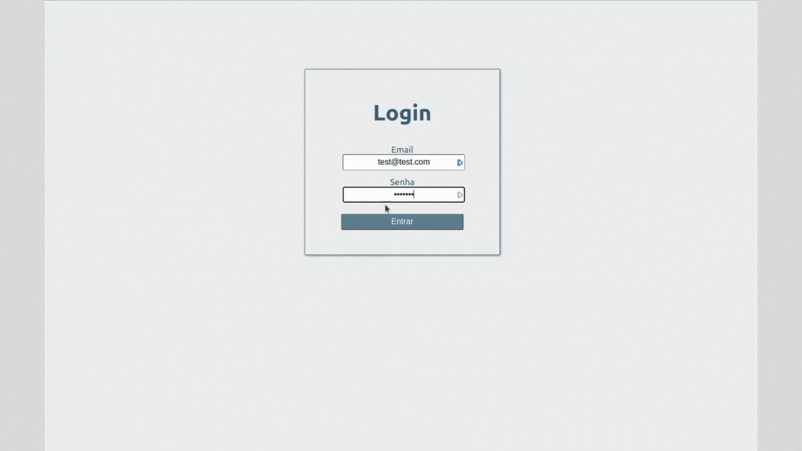

# Projeto Trybe Wallet

:rocket: *Desenvolvido entre 03/2022 e 04/2022 - Bloco 15/Trybe*



## :dart: Objetivo

Desenvolver uma aplicação que faz o controle de gastos sendo possível realizar a conversão de moedas.

Nesta aplicaçao, a pessoa será capaz manipular os gastos de suas despesas.

## :brain: Habilidades desenvolvidas

- Utilizar React para o desenvolvimento
- Lidar com os ciclos de vida dos componentes
- Gerenciar o estado com Redux: *store*, *reducers*, *actions* e *dispatchers*
- Fazer a validação das props do componente com PropTypes
- Realizar a requisição da API de contações de moedas
- Estilizar a aplicação

## :hammer_and_wrench: Ferramentas utilizadas

- CSS
- React
- React-Components
- Redux com React
- Redux-Thunk
- [API Awesomeapi](https://economia.awesomeapi.com.br/json/all)

:zap: *Todos os projetos da [Trybe](https://www.betrybe.com/?utm_medium=cpc&utm_source=google&utm_campaign=Brand&utm_content=ad03_din_h&gclid=Cj0KCQjw852XBhC6ARIsAJsFPN0TgLB25i-0iaTXpXGAYC5i-3mDoTto4laUGYI5XZFJpSlNbrojLuUaAs6cEALw_wcB) utilizam Linters, Git e Github*

## :pushpin: Rodando localmente

Clone o projeto e entre no diretório

```bash
  git clone git@github.com:Jacqueline-Silva/trybe-wallet.git && cd trybe-wallet
```

Instale as dependências

```bash
  npm install
```

Inicie a aplicação

```bash
  npm run start
```

## :mailbox: Contatos

[](https://www.linkedin.com/in/jacqueline-sxds/)
[](https://github.com/Jacqueline-Silva)
